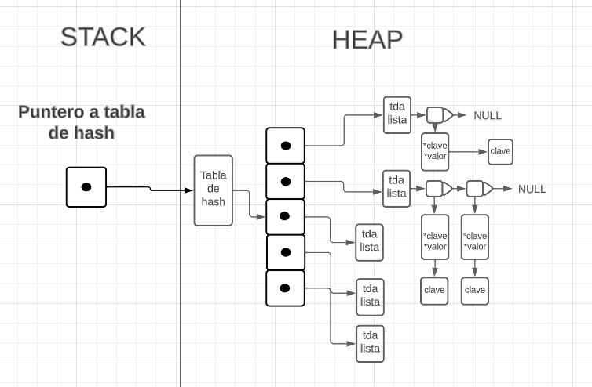

<div align="right">

</div>

# TDA HASH

## Repositorio de Gaspar Amato - 111137 - gasparjamato@gmail.com

- Para compilar:

```bash
gcc -o hash hash.c
```

- Para ejecutar:

```bash
./hash
```

- Para ejecutar con valgrind:
```bash
valgrind --leak-check=full ./hash
```

## Respuestas a las preguntas teóricas
Incluír acá las respuestas a las preguntas del enunciado (si aplica).

1. Un diccionario es una estructura de datos diseñada para organizar información con el objetivo de realizar búsquedas de manera eficiente. Esta estructura asocia keys (Claves) con values (valores), garantizando que las claves sean únicas y estén vinculadas a un valor específico.

2. Una función de hash es una función matemática que toma una clave como entrada y devuelve un valor. Este valor se utiliza para determinar la posición en la tabla de hash donde se almacenará el valor asociado con esa clave. La idea es que diferentes claves deben mapear a índices diferentes en la tabla de hash, y la función de hash debe distribuir las claves de la manera mas uniforme posible. En caso de colisiones, donde dos claves generan el mismo valor de hash, se utilizan dieferentes metodos para manejarlas.

3. La tabla de hash es una estructura de datos diseñada para almacenar pares clave-valor, permitiéndonos recuperar valores eficientemente a través de una clave específica. Utiliza una función de hash para transformar cada clave en un índice numérico que indica la posición de almacenamiento en la tabla. Esta función juega un papel crucial, ya que busca distribuir las claves uniformemente en la tabla, minimizando colisiones. Algunos metodos para solucionar estas colisicones son: 
  "Encadenamiento": Consiste en que cada elemento de la lista de hash apunta a una estrauctura, cuando se genera una colision simplemente se agrega el par a esa estructura de datos, esta estructura puede ser una lista, un arbol binario, etc.
  "Probing": El probing lo que hace es que cuando surge una colision manda el elemento a la siguiente posicion(en orden) de la tabla que tenga un espacio vacio y lo almacena ahi.
  "Zona de desborde": Este metodo consiste en que si sucede una colision envia el par a la zona de desborde la cual puede ser una lista, array, etc.

## FUNCIONAMIENTO
El programa es una implementacion de una tabla de hash abierta. esta estructura permite asociar claves unicas con valor y facilita la busqueda eficientes de estos valores a traves de sus claves. En este caso para las colisiones se utiliza el metodo de encadenamiento utilizando listas enlzadas y tiene funciones para la insercion, eliminacion, busqueda y destruccion de elementos en la tabla de hash.

### Estructuras:
        hash_t: Estructura que representa la tabla de hash. Contiene la capacidad de la tabla, la cantidad de elementos, y un vector de listas.
        keyvalue_t: Estructura para representar pares clave-valor.

### Funciones Principales:
        hash_t *hash_crear(size_t capacidad):
        Crea una nueva tabla de hash y devuelve un puntero a ella.
        
        hash_t *hash_insertar(hash_t *hash, const char *clave, void *elemento, void **anterior): Inserta un nuevo elemento en la tabla.
        
        void *hash_quitar(hash_t *hash, const char *clave): Elimina un elemento de la tabla y devuelve su valor.
        
        void *hash_obtener(hash_t *hash, const char *clave): Obtiene el valor asociado con una clave.
        
        bool hash_contiene(hash_t *hash, const char *clave): Verifica si la tabla contiene una clave dada.
        
        size_t hash_cantidad(hash_t *hash): Obtiene la cantidad de elementos en la tabla.
        
        void hash_destruir(hash_t *hash): Libera la memoria asociada con la tabla de hash.
        
        void hash_destruir_todo(hash_t *hash, void (*destructor)(void *)): Libera la memoria de la tabla y sus elementos utilizando una función de destrucción personalizada.
        
        size_t hash_con_cada_clave(hash_t *hash, bool (*f)(const char *clave, void *valor, void *aux), void *aux): Itera sobre todas las claves de la tabla.

### Tabla hash

A continuacion una representacion de la tabla.
<div align="center">
        
</div>
Como se puede ver, en mi implementacion de tabla se utiliza un vector el cual cada elemento apunta a una lista diferente y a su vez cada elemento de los nodos apunta a un par clave-valor(keyvalue_t) y tambien en ese par, el puntero key apunta a una copia de la clave proporcionada. Toda la estructura vive en el Heap.  

### Consideraciones

1. Tabla de hash almacena una copia de la clave proporcionada y no la original. 
2. Otra consideracion es que el rehashing o sea el agrandamiento de la tabla sucede cuando el factor de carga supere el 75%. Este rehashig genera que la capacidad de la tabla pase a ser 4 veces su valor.